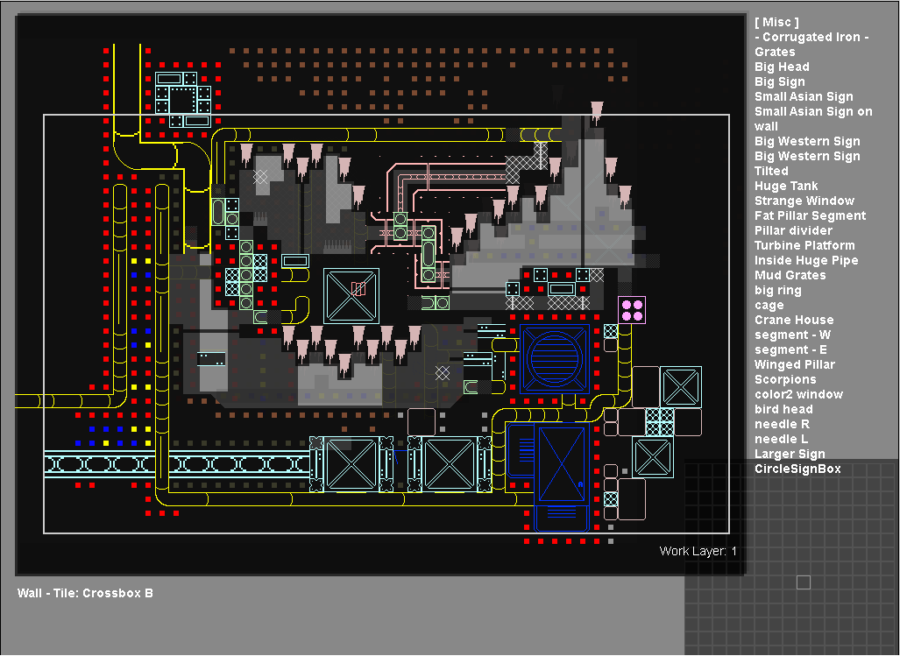
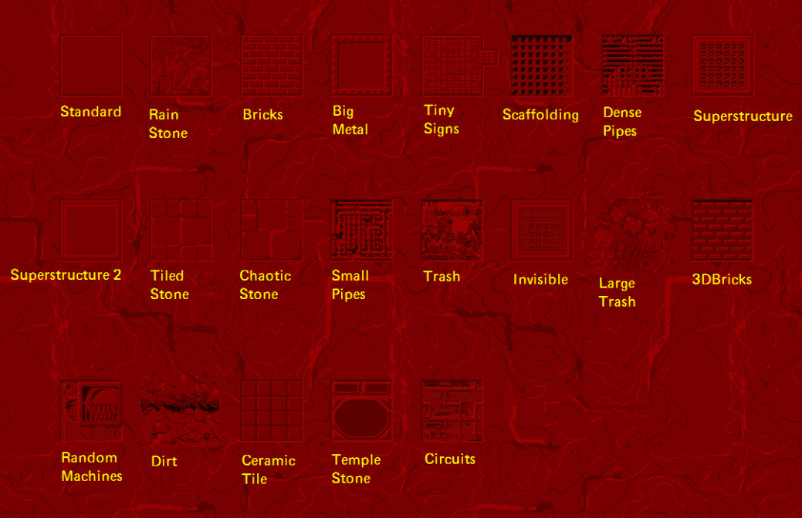

# Level Editor: Tile Editor

The Tile Editor is where you define the tiles and materials that provide the visual representation of the level geometry created in the [Geometry Editor](https://rain-world-modding.fandom.com/wiki/Geometry_Editor). Because the actual coloring of levels is done dynamically in-engine, Level creators are afforded incredible flexibility in the tiles and tile combinations that match. On top of that, the game shipped with a massive asset library which can be leveraged to create new and exciting styles. Tiles in the tile editor span the range from small nondescript square stones to the massive metal gates connecting regions.

The base of your intended visual style stems from the tile choices you make here in the Tile Editor. Further refinement of the art and aesthetic style comes from later work in the Effects Editor, Light Editor, and Prop Editor.

## Controls

---

On the right side of the screen, A and D allow you to select from the available tile categories. W and S allow you to select a tile from the chosen category.

When your in the materials or special category "default material: *material* (press E to change)", the default is always concrete but if you press E with a different material tile it will change to that instead.

Your mouse cursor gives you a preview of the appearance of your tile which you can place with left click. Right click removes tiles. Hovering over a tile displays its name in the bottom left.

Q Copy-selects a specific tile when hovering over it with your mouse

L changes the active layer (displayed in the bottom right).

F and V changes the material placing brush to 3x3 and 5x5 respectively.

G forces a tile to place with the geometry of the tile. F forces a tile to place without the geometry of the tile.

Tab + X + C clears all tiles (***there is no undo button***, only reloading from a previous save, so BE CAREFUL).

## Tile Types

---

Tiles come in a variety of flavors. Materials are the core and most flexible tiles as they procedurally generate to fill any size or shape. With the Materials category selected, an option to choose the default material appears (select the intended material and press E to assign it). The default material will be applied to any solid grid squares not manually assigned to something else. Materials are represented by colored squares in the tile editor. Pictured to the right is a fantastic cheat sheet made by AndrewFM that gives you a preview of each of the materials.

Outside of materials, the rest of the tiles are designed to either fill solid geometry (like stone blocks) or air (like fences). Some tiles require a specific pattern of both (like the crawlspaces which require walls on either side and air in the center). Tiles will appear red and refuse to place if they aren't on a grid square with the type of geometry they require, so some experimentation is required. The dark grey grid in the bottom right provides a preview of the necessary geometry if you're struggling to figure out why a tile won't place.

Unfortunately, outside of the awesome cheat sheet for materials AndrewFM put together, the only way to know what a tile actually looks like is to render the level, and while most of the editor previews are pretty accurate, some can be misleading. Because of this, occasionally doing a test render is highly recommended before pouring hours into tile details. It can also be helpful to make your own test sheets before detailing a room. By rendering a simple test room filled with the tiles that you think might fit your intended style or that catch your eye, you can save yourself a lot of time carefully arranging a bunch of things that turn out to look nothing like you hoped.

## Tile Cheat Sheets

---

https://imgur.com/a/Vz3Kk