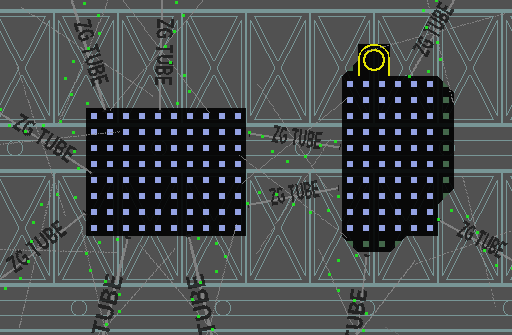
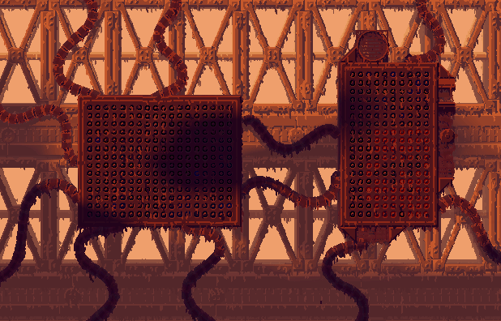
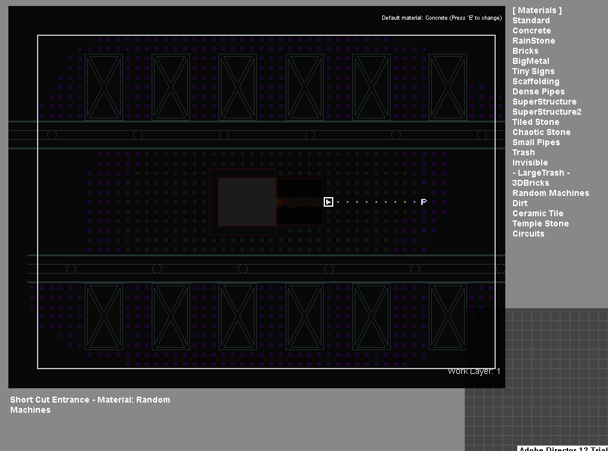
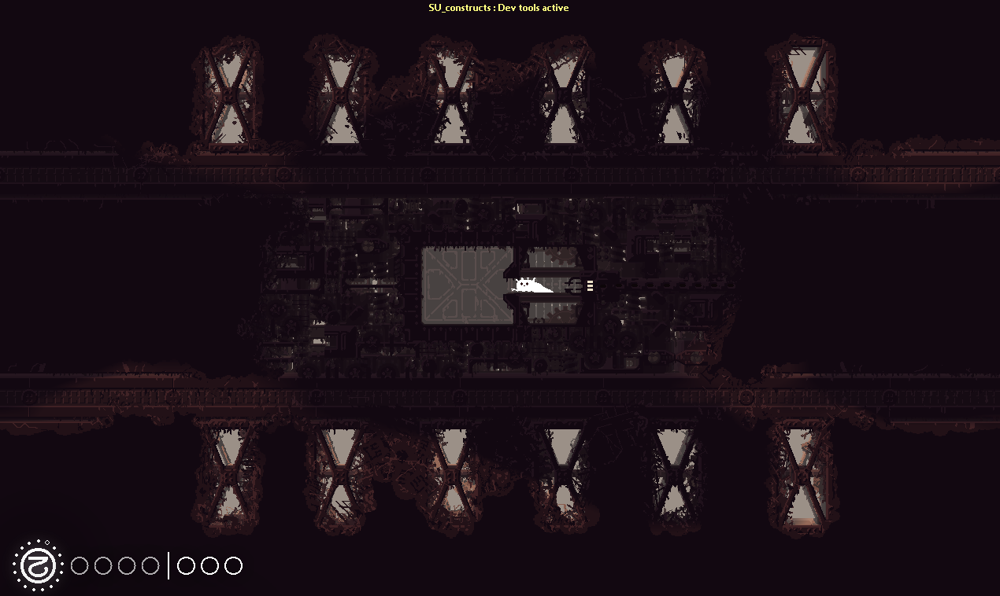
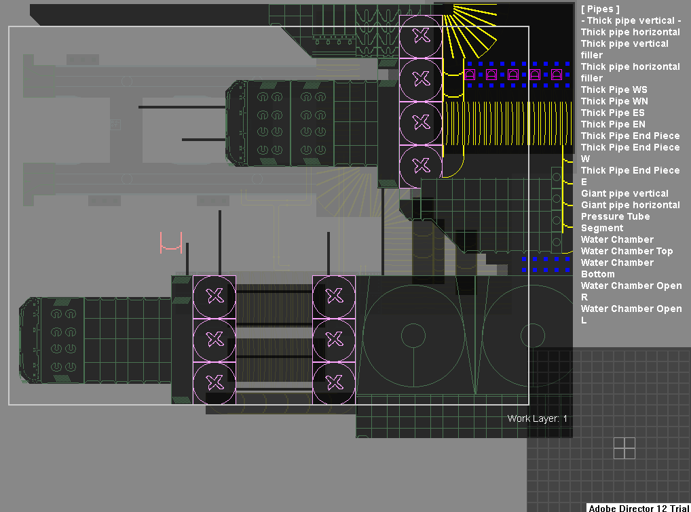

# The Architecture of Rain World

## **<u>This article is contains outdated information and needs to be updated!</u>**

This article is a collection of guides dedicated on explaining how to get certain structures seen all throughout Rain World "just right." Anything from tips and tricks, to guides of how to make complex multi-tile machines. These guides are not limited to just vanilla Rain World, and any other unique and helpful structures are welcome to be added!

## Sky Islands Data Boxes

---

Flashing blinking lights surrounded by kinked tubes and machines are used in a few isolated rooms in sky islands.

### Basic Construction:

A large rectangle of "SuperStructure" material. With ZeroG tube props between it and the nearest walls. Can optionally be covered by machines or cement, and then washed over with slime effect to make it slightly more rough and broken down. In game, a "superStructureFuses" object needs to be placed and aligned with the holes on the material to properly display the blinking lights inside the machine. Various objects and machine can be placed around it to extend the object from being a simple blinking box, into some strange machine. The rooms palette and cloud cover helps to hide the simplicity of the actual construction.

## Custom Shelters

---

Constructing a simple shelter for Rain World. Shelter have some specific requirements. Most can only be constructed with single doors due to how the shelter's gate will automatically latch onto the first door as a "root." This guide will only be for constructing the very basics of a shelter.

### Basic Construction:

A shelter's required parts are under the shelter category in the tile editor. The dot on the shelter gate is the end that points towards the door of the shelter. This is not required however, but the dot should point away or toward the shelter, or the tunnel inside it will be rotated wrong. Only one set of locks will spawn in a shelter.

The shelter's chamber only has one entrance from one of four directions. There is also a large and small variant to shelter chambers. The chamber is not required, however all vanilla shelters use these. Not placing a chamber will cause the save room to place you right against the wall opposite the door when you wake up. The shelter's lock will also start to close as soon as slugcat is no longer inside a crawlspace.

Finally, when linking your room to the region. Place a SHELTER tag at the end of the line. An example from outskirts.

- SU_S03 : SU_B01 : SHELTER

## The Wall - General Style Guide

---

*NOTICE - The Wall is a very complex and multilayered area. Experience with the editor is heavily recommended!*

The wall's construction is a mix of large detail tiles from "The Wall" category. Cooling rods are assembled out of their component pieces, usually in order of large rod segments with one or two tip segments before their cap. However oddly ordered rods can spice up the look. Rods often have poles sticking out from their caps. The bases of cooling rods are always present in single or pairs. These rods are connected directly to the wall using three "Giant screw" tiles from the "machines" category, and then connected to giant pipes traveling into the wall.

The Wall itself is constructed of cement, and dense pipes. Using huge pipes and other segments of the wall as spacers. The base of cooling rods can also attach to larger dome machines. These often have multiple segments of "under cooler" beneath them.

If you need to pass between a cooling rod and the wall itself. The two segments are separated by three giant screws on each side. With huge pipes between them. Poles are used to climb between the gaps. Short cut entrances are very often wedged between wall segments, or directly attached to the tops of domes or pipes. Short cuts almost never come out from cooling rods themselves, but from the larger structures behind them.

Cooling rods along the side of the wall are used as floors and ceilings to rooms. However the Wall's cooling rods never extend for more then room in width. The only segments of the wall that stick out from the wall itself are large spherical chambers with antennas on them. These will be done in a separate architecture guide.

The far background of the Wall consists of thick pipes, cement, and rarely a "very large beam" from the "metal" category. The tips of these beams can be capped off with "pillar beam connection"s from the "underhang" category.

The wall's materials are broken up into two segments. Certain areas having large chunks of "random machines" fitted with pipes. The tunnels through the machines using "crawlspace" tiles on top of them. Other tunnels outside of the machines use "crawlhole" tiles. The upper sections are dotted with "Asian sign" tiles. Usually mixed between dense pipes or scaffolding. These can be used to break up the color of the palette and make your walls seem less uniform. Huge chains are used as props to beak up the background itself. These are anchored to beams and the Wall's side by small blocks of "random machine" material.

Plant life along the wall is very scarce. Mostly being various grasses and hanging roots. The rubble effect is also used here to create a more varied ground. However, using piles of large trash or dirt can also work to break up the straight lines that the cooling rods and domes create. Grasses often grow out of these. Food is also rare on the wall. Very few segments having hanging fruits. Slime and BlackGoo effects as always help to break up the more straight and dull segments of bare materials. The underside of cooling rods are slimier then the tops. Hanging chains can also be used to help break up the background. Just be sure none of the chains connect off the edge of the screen!

Finally. The "AboveCloudsView" room setting in the [dev tools](https://rain-world-modding.fandom.com/wiki/Dev_Tools) is used to draw the giant sea of clouds view near the upper half of the wall. This however, requires your room to be at a certain height above 0 in the [Map Tab](https://rain-world-modding.fandom.com/wiki/Map_Tab)'s "canon view." An easy method to configure this is to simply drag the first room you want this effect to appear in upwards on the map. Save, and reload the room by dying. If the effect is not far enough up the wall yet, keep going. If it is too far, move it back down until you are happy with its elevation, and then build your map off of this room's elevation.

The default palette of the wall is 19, with a very slight fade to 29. EffectA is 8 and effectB is 7. A heavy fog, a light bloom, wind sounds with the wall's own unique humming sound effects complete most of the region's ambience. Don't be afraid to explore some stranger twists to the region's structure however!