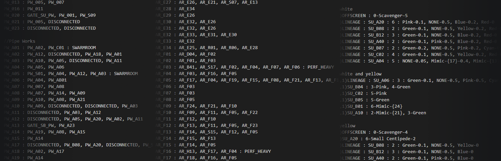
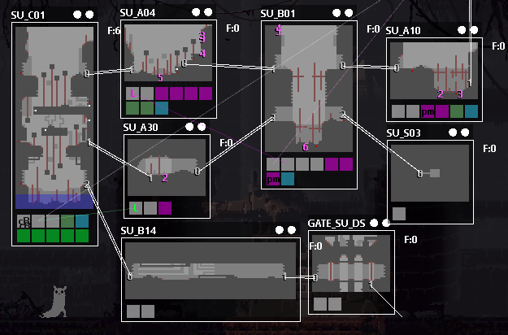

# World File Format

The world_XX.txt file is present in every region Rain World loads, and determines various room settings such as their pipe connections, the spawns of enemies, and specific flags like shelters and gates. Creature spawns only happen the first time you enter the region on a file, so tweaking creature spawn points requires a save that has never entered the region, or a fresh file entirely.

Likewise, adding new maps to a region or changing map interconnections can break the spawn locations of creatures in an existing save file. When broken, the devtools map will show creatures bounding around in tight circles. To fix this, **use a fresh save after adding any maps to a region or changing connections**. Going to a shelter and starting the next cycle will work fine.

## Room Connections

---

Room connections fall between the tags ROOMS and ENDROOMS. These control which pipe entrance leads to what room, and vice versa. Unique room flags that specify certain attributes about the room (such as if it is a shelter or a gate room) are set here as well. The format is as follows:

> ROOM : door0, door1, door2, etc : FLAG

### Examples include:

A standard room with two room-connecting pipes. These will form the bulk of your region.

> TR_T07 : TR_T01, TR_P02

A standard room, with five doors. However, pipes 1, 2 and 3 have no connection. Each pipe inside a room has a specific number starting from 0. These can be viewed using the [Dev Tool's](dev-tools/Dev-Tools.html) [Map Tab](dev-tools/Map.html), or by entering the room with dev tools enabled and pressing M.

> TR_W19 : TR_L05, DISCONNECTED, DISCONNECTED, DISCONNECTED, TR_W18

A shelter. These rooms will often be copied from other regions when you are first learning how to make a region. All vanilla save rooms have a single door.

> TR_S01 : TR_P01 : SHELTER

A region gate. Doors on the other side of the gate are set to DISCONNECTED. They will automatically be shown as connected doors due to the gate's special flags. If you need to show a save room door specifically on the other side of the gate. You can use the ExitSymbolShelter object, in the dev tool's [object tab](dev-tools/Objects.html) to change the door symbols as required.

> GATE_SS_TR : DISCONNECTED, TR_L07 : GATE

A swarm room allows batflies to spawn in the room, as long as the map contains bat nests. If the room has bat nests but is not marked as a swarm room, those nests will always be inactive. The dev tool's map tab provides the options needed to control where they will migrate and rooms they will avoid.

> SU_A06 : SU_A39, SU_A36, SU_A38 : SWARMROOM

A scavenger outpost. Wip....

> SU_C02 : SU_A45, SU_A07 : SCAVOUTPOST

### Understanding door connections:

For a door to be properly connected, both ends must point to each other using valid doors. For this example, both rooms will have two doors. Door0 will be on the left, and door1 on the right. Door numbers are decided specifically for your room, so be sure to check in game how your doors have been assigned by the [Official Level Editor](/level-editor/Official-Level-Editor.html). The dev tool's [Map Tab](dev-tools/Map.html) can also be used to see the links between doors. As in the picture to the right. Properly connected doors will show both lines pointing to the set door on the other end. Doors with incorrect links will point off to the bottom right (A disconnected door will also do this,) and a door connected to another room, but that room has no door back( or lacks enough doors! ) will point to the center of the room on the map tab page.

> RG_ROOM1 : DISCONNECTED, RG_ROOM2

> RG_ROOM2: RG_ROOM1

Room1 will have its right hand door connected to Room2. Because of this, we need to use DISCONNECTED as a placeholder for its left hand door, door0. Then set door1 to connect to Room2

Room2 will connect to Room1 using door0. Due to this, we do not need to define the right hand door. It will assume it to be disconnected.

### Room Tags:

Room tags assign certain properties to rooms depending on what the tag is. Tags are assigned like

> [ROOM] : [CONNECTIONS] : [TAG]

Example:

> SU_A06 : SU_A39, SU_A36, SU_A38 : SWARMROOM

| **<u>Tag</u>** | **<u>Function</u>**                                          |
| :------------- | :----------------------------------------------------------- |
|                |                                                              |
| SHELTER        | Makes the room a shelter. When there are multiple pipes in the room: the animated door is placed at the bottom right most pipe. |
| GATE           | Makes the room a gate. Entrances on the other side of the gate are set to DISCONNECTED, and are shown automatically to be connected. |
| SWARMROOM      | Allows batflies to be spawned from batfly hives.             |
| PERF_HEAVY     | Makes rooms run better by simplifying certain processes. (This needs expansion/further explanation) |
| SCAVOUTPOST    | Makes the room into a scavenger outpost. Scavs will spawn here and only let you pass if you have a pearl. The outpost is controlled by the "ScavengerOutpost" devtools object. |
| SCAVTRADER     | Spawns a scavenger merchant into the room. Will trade items with you. The merchant is controlled by the "TradeOutpost" devtools object. |

### Important quirks to rooms and doors:

When setting up your region, be sure that you always use your region's prefix to help each room have a unique name. If not, Rain World will treat repeated names as being other rooms, and even re-use rooms from other region folders entirely. If you don't use your region prefix, changes made with devtools can also wind up getting saved to unexpected places. To avoid these problems, always prefix your room with its region code, and give them unique names.

Multiple pipes in a room may all go to the same room. However, these will all act like a single pipe, and you will not be able to set the specific destination pipes. There are no cases in vanilla Rain World where multiple pipes in the current room lead to the same next room. They will all lead to separate rooms. For example, if you had four pipes leading from one room to another. you would need to create a minimum of three unique rooms for each of the other pipes to act as an interconnection. TL;DR A room should not have multiple pipes leading to the same next room. Unless you expect to use this odd behavior to your advantage... such as four pipes in one room leading to a single exit in another, but returning only taking you to one of those entrances.

## Creature Spawns

---

Creature spawn data exists between CREATURES and END CREATURES tags. Most regions also use // for comments about the creatures or for separating the difficulties into specific sections. These comments however, do nothing to the code, and can even be used in the room connections above. Rain World only spawns creatures the moment you enter a region for the first time, or after an excessive number of cycles has passed. To properly test enemy spawns, you will need to use a fresh file, or to backup a save just before you entered the region. Editing the region while it has "stale" enemy data, will result in bizarre situations, such as enemies spawning in shelters, or changing their pipes to be in different rooms. These can be corrected simply by reverting to the backed up save before you entered the region, or wiping the file and re-entering the region.

> |                    |                                        |                       |                            |                          |                       |
> | :----------------- | :------------------------------------- | :-------------------- | :------------------------- | :----------------------- | :-------------------- |
> | <u>**Lizards**</u> | **<u>Insects</u>**                     | **<u>Amphibians</u>** | **<u>Flying</u>**          | **<u>Plants</u>**        | **<u>Other</u>**      |
> | Pink               | Spider                                 | Salamander            | CicadaA                    | PoleMimic, Mimic*        | Scavenger             |
> | Green              | Small Centipede                        | Leech                 | CicadaB                    | Tentacle, TentaclePlant* | Lantern Mouse, Mouse* |
> | Blue               | Centipede, Centi, Cent*                | SeaLeech              | Vulture                    |                          | Worm, Garbage Worm*   |
> | Yellow             | Red Centipede, RedCenti, RedCentipede* | JetFish, Jetfish*     | KingVulture, King Vulture* |                          | Miros, MirosBird*     |
> | White              | DropBug, Dropbug, DropWig, Dropwig*    | Snail                 | Needle, Needle Worm*       |                          | Tube, TubeWorm*       |
> | Black              | BigSpider                              | Lev, Leviathan        | SmallNeedleWorm            |                          | Bro, BroLongLegs*     |
> | Cyan               | SpitterSpider                          |                       | Cicada**                   |                          | Daddy, DaddyLongLegs* |
> | Red                | EggBug, Eggbug*                        |                       |                            |                          |                       |
>
> (*) Interchangeable names
>
> (**) Switches between CicadaA and CicadaB)
>
> 
>
> (optional difficulty)ROOM : PipeNumber-Creature-{optional flags}-Count

While this appears very complex, some examples will make it easier to understand, as not all entries and flags are required. The optional difficulties are 0 = normal, 1 = easy, 2 = hard.

### Examples include:

A single green lizard, spawning from pipe 2, on all difficulties.

> SU_A10 : 2-Green

A single red lizard, spawning from pipe 3, on hard mode only.

> (2)SU_A10 : 3-Red

A hoard of 5 yellow lizards spawning from pipe 1, on easy mode only.

> (1)SU_A10 : 1-Yellow-5

A Daddy longlegs spawning from pipe 4, but only on easy and normal difficulties.

> (0,1)SU_A10 : 4-Daddy

A very angry white lizard that spawns from pipe 3, on all difficulties. the "Mean" flag can be set from 0 to 1, and will change the enemy's personality to pursue you aggressively depending on how high it is set.

> SU_A10 : 3-White-{Mean:0.9}

Some enemies require a unique room known as OFFSCREEN. These enemies use special doors that are automatically added to your level to move between rooms. These include vultures, scavengers, leviathans, and miros birds. This example spawns two off screen vultures.

> OFFSCREEN : 0-Vulture-2

Enemy flags still apply to offscreen enemies. This will spawn a very aggressive KingVulture that will rarely leave the screen if it spots slugcat, but only on hardmode.

> (2)OFFSCREEN : 0-KingVulture-{Mean:1}

#### Important quirks to creatures:

Enemies may be set to spawn from the same nest pipes. However, do not be surprised if they somehow kill each other offscreen very quickly if you do this. A daddy long legs may have no problems consuming an entire hoard of yellow lizards for example.

Enemies will often drag you back to their home nest pipes, but may also choose other pipes they like, even in different rooms.

During the end of a cycle, almost every enemy will rush to a nearby nest, if they spawned from it or not.

Many creatures that would not intuitively appear to nest in pipes, likely does so, you just never reach them before they spawn in game, or their pipes are well hidden. A direct example of this, is that wandering daddy longlegs spawn from pipes, and return to their pipes before the end of a cycle. This includes the daddies inside Five Pebbles, which makes the area significantly easier once the cycle timer has counted down entirely.

It is important to understand various enemy interactions to help you build a cohesive and believable ecosystem for an area. Sandbox mode can help you learn which creature is where on the food chain. As well as looking at the interactions of creatures in other regions.

Some creatures have very specific requirements for rooms they inhabit. A very game breaking example, is that big spiders and spitting spiders require the ability to reach every wall in a room in some fashion. By pole, or by invisible ceilings out of the camera. If they cannot, the game will lag very badly due to the spider's failed pathfinding.

Some creatures have a heavier performance impact on the game then others. Sandbox mode can help you learn these, as it will show a notice that "too many of this creature will impact performance" when you begin to place too many. An example is that more then 4 daddy long legs on screen will often lead to lag. Unfortunate development gets around this problem by using the "stuckDaddy" object, as these daddies do not run wandering path finding checks.

All enemies can be configured using the dev tool's map editor to prefer, avoid, stay or be forbidden inside certain rooms while wandering. These spawn entries are simply where they will be created from when the player first enters a region.

### The Lineage System:

Enemy nests may also be configured to use the lineage system. After being killed, this allows a creature to roll a dice at the end of a cycle, and in a certain percent, respawn as its next entry in the lineage. Due to the format however, you cannot decide how many enemies can spawn from the pipe. So a green lizard cannot turn into a hoard of 3 yellow lizards. Only a single yellow lizard. Enemy flags, and difficulty filters still apply however. The format is as follows:

> LINEAGE : ROOM : PIPE : STARTENEMY-PERCENT, NEXTENEMY-PERCENT, FINALENEMY-0

PERCENT is a value between 0 and 1, and is the percent chance that the enemy will move onto its next form. You may have as many forms as you need. However, it is important to ALWAYS mark the last enemy in the lineage with a 0 percent chance to move on. Rain World will likely crash the moment it attempts to move to the next enemy in a lineage from the last, or display undefined behavior.

### Examples include:

A green lizard that spawns from pipe 2, that turns into a blue, and then into a red. With a 5% chance each time.

> LINEAGE : SU_B08 : 2 : Green-0.05, Blue-0.05, Red-0

A poleplant, with a specific height of 10 blocks, and spawning from pipe 3. That has a 10% chance to turn into a monster kelp

> LINEAGE : SU_A02 : 3 : Mimic-{10}-0.1, TentaclePlant-0

A empty pipe 3, that has a 1% chance to turn into a monster kelp.

> LINEAGE : SU_B02 : 3 : NONE-0.01, TentaclePlant-0

Lineage applies to offscreen creatures, as well as difficulties! This example from chimney canopy has a 20% chance to turn a vulture into a king vulture after being killed, but only on normal difficulty.

> (0)LINEAGE : OFFSCREEN : 0 : Vulture-0.2, KingVulture-0
>
> 

## Bat Migration Blockages

---

Bat migration blockages exist between BAT MIGRATION BLOCKAGES and END BAT MIGRATION BLOCKAGES tags. These are used specifically to prevent bat flies from entering a room, or pathing through the region to rooms on the other side of it. These are rarely used. However the room directly after the tutorial area in outskirts is set to be one. The format is simply to list each room line by line between the two tags. There are no unique flags.

For the example in Outskirts, bat flies cannot enter room SU_A22 because it is between the tags:

> BAT MIGRATION BLOCKAGES
>
> SU_A22
>
> END BAT MIGRATION BLOCKAGES