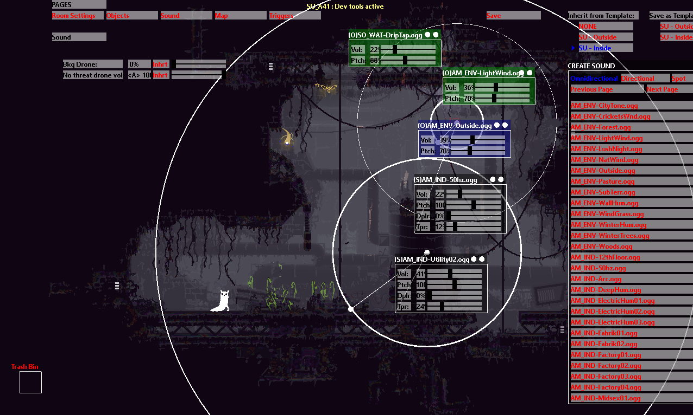

# Dev Tools: Sounds

This is a single tab for the [Dev Tools.](Dev-Tools.html) See that page for more controls and other tabs.

This editor tab allows you to place various sounds into the room. Omni-directional sounds will play regardless of your location in the room, and from all directions. Directional sound is similar, you can control the direction the player will hear the sound from their speakers in. Finally spot sounds will play from a specific location in the room, with a configurable fading distance. All sounds can have their pitches and volume tweaked to fit the mood of the room. Take a peak at rooms in the vanilla game to get a sense of how loud sounds normally are in game.

## General Controls

---

### PAGES:

Brings you to the other devtool editors.

### Save:

Saves the current sounds to a file inside the region's World folder, named ROOMNAME_settings.txt.

### Mouse input:

Positional sounds can be grabbed with the left mouse button. Releasing will put them down. Dragging the sound to the bottom left into the trash bin box will remove it.

## Sound

---

While this tab is open, and the Bkg Drone volume is above 0%, you you can move your mouse from the left of the screen to the right, to preview the varying levels of threat music your region has. The left being the lowest, and right being maximum threat.

### Bkg Drone:

The volume of procedural enemy encounter music. 28% is the default volume in most areas.

### No Threat Drone Vol:

wip...

## Create Sound

---

### Omnidirectional:

Sounds selected with this option selected will play at a set volume regardless of location in the room. Clicking the sound again in the list will remove it.

### Directional

Sounds selected with this option will play from a specific direction from the speakers. regardless of slugcat's location in the room. Clicking the sound again in the list will remove it.

### Spot

Sounds placed with this option will have a radial tool to control where they are heard at their maximum volume, and how far their noise tapers out around them. Dragging the sound into the bottom left trash box will remove it.