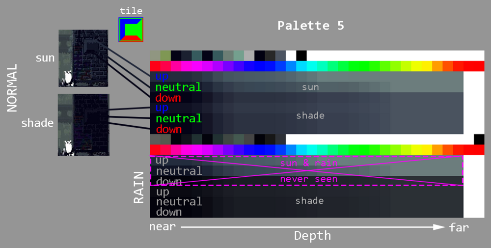
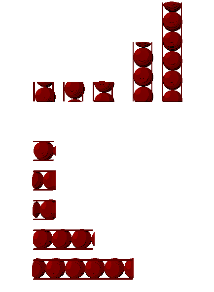
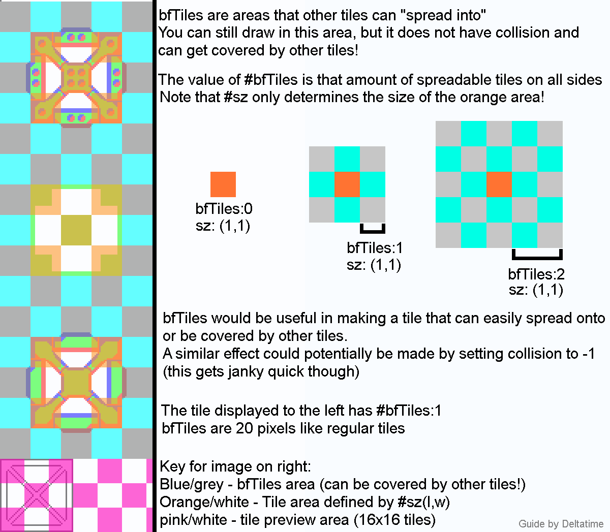
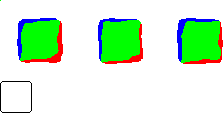
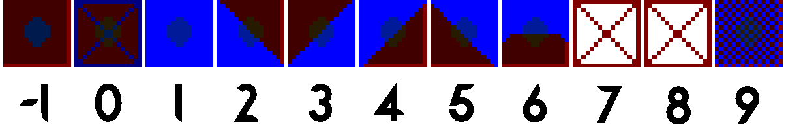

# Custom Palettes, Tiles and Props


## Palettes

Palettes are very easy to change and modify, you can find them in Rain World\Assets\Futile\Resources\Palettes. I recommend just copy and pasting one of the palette.pngs in there already, and renaming it to the next available number (Ex: Palette37). However, if you're making a region you will share with the community, I suggest looking for free palette names in the Palettes page of the Region Lease found [here](https://docs.google.com/spreadsheets/d/14wt42_ZalI5di8zpUFx3WvPWldC_L7SwIbgb_TxOpUk/edit#gid=1310131772). You can find a handy palette key of most of the colors [here](https://i.imgur.com/6rI8pWa.png), but the big un-labeled space is the main palette of the room itself. The best way to make a palette is modifying it while in-game. To see any changes, just save the .png and re-enter the room with the palette.

The following image shows how a palette is organized:


The top palette is for a normal cycle. The bottom palette is before rain.
Within a palette, the top half is for sun and the bottom is for shade.
Within sun or shade, the 3 rows color surfaces facing up, neutral, or down.
Within a row, colors from left to right correspond to near and far layers (from 1 to 30)
The rainbow in the palette is used for the rainbow object or the grime.


## Tiles

All of the tiles the editor uses are located in the Graphics folder, and they look like this image [here](https://i.imgur.com/iiz0s3u.png). The tiles are in layers, with the bottom one being the image for the tile editor. The tiles follow a 20x20 pixel grid while the image for the tile editor follows a 16x16 grid. The blue is the lit colour of the layer, the green is the normal colour of the layer, while the red is the shaded colour of the layer. The top row of pixels HAS to be pure white, except for black pixel in the top left.

All of the collision details and more are stored in the init.txt.

Things like this, `-["SU patterns", color(210, 0, 255)]`
are the categories. The name is in quotes while the color, which applies to previews from tiles in the category, follows RGB values. 

The rest are the properties of the tile, which look like this. `[#nm:"Block Edge N", #sz:point(1,1), #specs:[1], #specs2:0, #tp:"voxelStruct", #repeatL:[1,1,1,1,1,4,1], #bfTiles:0, #rnd:1, #ptPos:0, #tags:[]]`. 

- `#nm` Is the name of the tile. 

- `#sz:point()` is the size of the tile in a (x,y) format. 

- `#specs` is what the collision is. The `#specs` are dependent on the `#sz:point`, so if it’s 4,6 you would have 4 groups of six numbers. Say, you had a 8 long and 3 tall tile, whose the geometry is fully composed of solid blocks, its specs would look something like this: `[1,1,1, 1,1,1, 1,1,1, 1,1,1, 1,1,1, 1,1,1, 1,1,1, 1,1,1]`.
It’s important to note that the collision is **NOT** horizontal, but rather vertical. So in that, the first 3 numbers would change the first column from top to bottom and so on.

- `#specs2` is used for tiles that occupy 2 layers (such as some of the VeryLargeBeam tiles) and should in most cases be set to 0 or void.

- `#tp` is the type of the tile. It can be: 

	- "voxelStruct": the basic type for tiles;

	- "voxelStructRockType": doesn't need `repeatL`, repeat the first layer 10 times;

	- "voxelStructRandomDisplaceVertical" or "voxelStructRandomDisplaceHorizontal": randomly displaces the tile's graphics horizontally or vertically while rendering like this:

;

	- "box": wip;

- `#bfTiles` is set this way: 

*credit to DeltaTime for the guide on bfTiles*

- `#rnd` is the number of variations of the tile that are choosen randomly while rendering. They can be changed using the seed. The varitions have the same geometry, number of layers, bfTiles, etc, and are on the same line on the image of the tile. Here is an example of tile that has random variations:
```[#nm:"Square Stone", #sz:point(2,2), #specs:[1, 1, 1, 1], #specs2:0, #tp:"voxelStructRockType", #bfTiles:1, #rnd:3, #ptPos:0, #tags:[]]```


- `#ptPos` must be left as 0.
- `The tags` can just be left empty if you want, or you can use the tags in this list: 

	- "notTrashProp": disallows the tile from being used in the largetrash or trash materials spread;

	- "notProp": disallows the tile from being placed with the prop editor;

	- "nonSolid": WIP;

	- "ramp": make the tile has two random variations (more info to find here);

	- "drawLast": draw the tile last while rendering;

	- "Big Sign": place a random big sign above the tile that follows effect color A (variation can be changed using the seed);

	- "Small Asian Sign": place a random small sign above the tile that follows effect color A (variation can be changed using the seed);

	- "small asian sign on wall": same as "Small Asian Sign", but the sign is more in the background;

	- "Big Western Sign": place a random big western sign above the tile that follows effect color A (variation can be changed using the seed);

	- "Big Western Sign Tilted": same as "Big Western Sign", but the sign is tilted;

	- "Larger Sign": place a random larger sign above the tile that follows effect color A (variation can be changed using the seed);

	- "Big Wheel": place 2 big wheels at the center of the tile, on different layers and with random rotations;

	- "Chain Holder": place a big chain which the beginning is at the middle of the tile and the end at the place we clicked right after having placed the tile in the tile editor;

	- "fanBlade": place several fanblades at the middle of the tile and on different layers;

	- "harvester": place harvester "eyes" with random rotations (the tile need to be called Harvester A or Harvester B);

	- "Temple Floor": place two temple stone slopes at the NW and NE corners of the tile (made for the Temple Floor tile);

	- "glass": is meant to put a "glassImage" on all the tile, but the image is empty.

	- "randomCords": put small random cord at the middle of the tile.

("randomRotat" does nothing for tiles and "color2 window" does nothing at all)

- `#repeatL` is a very important property: it dictates how many times the layer is repeated. If you have a tile with 3 layers, you’d want 3 numbers, with each number saying how many times the layer is repeated, starting from the first layer.

An incredibly useful tool when developing custom tile collision is the [Specs Editor](https://drive.google.com/file/d/17hWH494JwnAOrjo3Xyh8J_QZbbuAA3CO/view), a program designed to create tile dimensions and collisions, along with making the process more intuitive and easier.

Otherwise, you can write the collisions manually using numbers. Here are the numbers associated to the different geometries:

(7 is shortcut but doesn't work as tile geometry, and 8 is nothing).

If you need any help, don’t be afraid to ask Twelve Havens on the official rain world discord.


## Props

All of the props the editor uses are located in the Props folder.
VERY WIP
