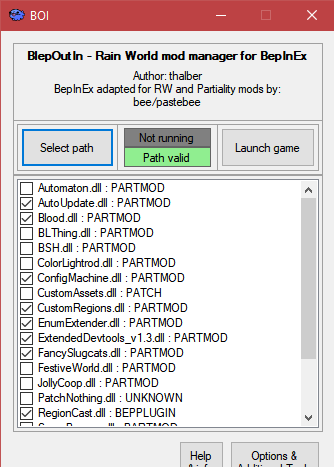

# BepInEx

BepInEx is a plugin framework primarily for Unity games. In the Rain World modding community, we are migrating to a modified version of BepInEx (from the Partiality launcher, which is now abandonware). 

**Very important note:** the generic BepInEx releases are not directly compatible with Rain World / RW's old Partiality mods. It is imperative you use modified Rain World BepInEx for support with the majority of existing Rain World mods (information current on 29th Dec 2020).

---
## Installation

The following video tutorial made by LeeMoriya explains how to install both RW BepInEx and BOI (see below), as well as the additional steps required to migrate from Partiality to BepInEx if applicable). <https://youtu.be/brDN_8uN6-U>

RW BepInEx can currently be downloaded from [here](https://drive.google.com/file/d/1WcCCsS3ABBdO1aX-iJGeqeE07YE4Qv88/view). Download this and extact the contents of the zip archive. Place the `BepInEx` folder, and `doorstep_config.ini` and `winhttp.dll` files in your `Rain World` folder.

*"Where do my mod DLLs go?"*
- Partiality hook mods and BepInEx plugins go in `BepInEx/plugins/`
- Patch mods - rename to format `Assembly-CSharp.[modname].mm.dll` and place in `BepInEx/monomod/`
- Standalones are discouraged. Those that do exist the file at `Rain World/RainWorld_Data/Managed/Assembly-CSharp.dll`

If you can't be bothered will all of this, see the section about BOI below.

Other mods, such as region packs, are not managed by BepInEx. Many mods come with a README file containing installation instructions... Reading that is a good idea.

---

## Differences from Partiality

*Partiality is a deprecated mod launcher that used to be the primary mod loader for the Rain World modding community. It served us well, but now BepInEx is here as a superior alternative.*

### BOI Interface

BepInEx doesn't have a graphical user interface (or GUI - the app with buttons and such). Obviously this is a little tedius for some users... This is where thalber's BlepOutIn (or BOI) launcher comes in. BOI is an app that provides a nice interface for RW BepInEx, as well as some other related tools such as easy access to Extended Dev Tools settings and region pack settings.

You can find the release page for BOI [here](https://github.com/thalber/BOI/releases/latest). 

### Increased stability

The BepInEx part of RW BepInEx has been tested by a community far larger than Rain World, as it is used for many other Unity games. This means that it is more reliable and stable than Partiality. In addition, future bugs found in BepInEx and BOI will likely be addressed promptly, whereas Partiality is abandoned and will receive no widespread support.

### Ability to run BepInPlugins

BepInPlugins, as the name suggests, are plugins made for BepInEx. Simply put, they won't run on Partiality. There are now a variety of BepInPlugins available, and they should tell you what they are.

As mentioned at the top of the article, RW BepInEx supports the use of Partiality mods.

---

## Replacement of Publicity Stunt

Publicity Stunt [link to pubstunt page] was discovered to cause issues when using BepInEx. This caused two issues that have now both been addressed...

### Referencing private members

To reference private members of the game's code, [download GeneratePublicAssembly.dll](https://beestuff.pythonanywhere.com/audb/api/mods/0/21/download/latest) , place it in `Rain World/BepInEx/patchers` , and run the game using RW BepInEx. A modified version of `Assembly-CSharp.dll` should appear in the root Rain World folder with its private members made public. *Do not distribute this - this is for your own use.* 

### Accessing private members during gameplay

The file `Dragons.PublicDragon` distributed with RW BepInEx deals with the seemingly random interaction of BepInEx and pubstunt by patching all mod assemblies with some code that tells them to ignore access modifiers. Because of this,  even if your mod requires access to the game's private members, end users are not required to do anything beyond using your mod with RW BepInEx to allow this.

