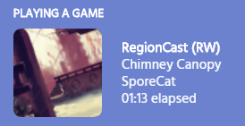

# RegionCast

RegionCast is a [BepInPlugin](https://rain-world-modding.github.io/rain-world-modding/pages/creating-mods/BepInPlugins.html) and side-app combo created by casheww that adds Discord Rich Presence to Rain World. The Rich Presence details the player's current location, the game mode, and the time elapsed from when they started that game mode. It also supports customisation from region pack creators and custom slugcat creators [hyperlinks to relevant pages] . 

The latest release of RegionCast can be found [here](https://github.com/casheww/RW-RegionCast/releases/latest) - be sure to read the README for installation instructions. 

---

## Customisation for other modders

### Custom Region names

By default, RegionCast will use the (sub)region names already specified by the game (the ones read from the region's `Properties.txt` file). However, by installing a region with Garrakx's CRS [hyperlink when page exists] and adding a simple file, this can be overridden. Reasons to do this may include preventing spoilers for your region pack appearing in players' or region developers' Rich Presence, or shortening the name of a location that would otherwise be cut off by Discord's character limit.

1. Navigate to `Rain World/Mods/CustomResources/<region-pack-name>/World/Regions/<region-code>/` and add a file called `RegionCast.txt`. 
2. For each of the location names your wish to change, add a line in the new file with the format `region-name:name-to-display`- e.g.: `Underbelly:Soggy Place` would display "Soggy Place" when the location would otherwise be called "Underbelly" (assuming the file location is correct).

### Custom Region thumbnails

Due to the way Discord handles Rich Presence assets, the only way for a region pack to receive region thumbnail support is by submitting through casheww. An GitHub issue may be submitted for this using [this issue template](https://github.com/casheww/RW-RegionCast/issues/new?assignees=casheww&labels=custom+region+req&template=custom-region-request.md&title=Custom+Region+%3A+%5BRegion+name%5D). A list of the custom regions with custom thumbnail support on RegionCast can be found [here](https://casheww.github.io/RW-RegionCast/). 

### Custom Slugcat names

Note: *this section refers to mods that add a new slugcat to the game, not those that just modify sprite atlases or overwrite existing character slots.*

Everyone loves slugcats!
In the game's story mode, RegionCast reads and uses `Menu.SlugcatSelectMenu.SlugcatPage.colorName` to display on the Rich Presence. This is done from a hook to `Menu.SlugcatSelectMenu.SlugcatPage.Singal` if the... *singal* message is "START", signifying that the gameplay is about to be loaded - RegionCast stores the `colorName` for later use.